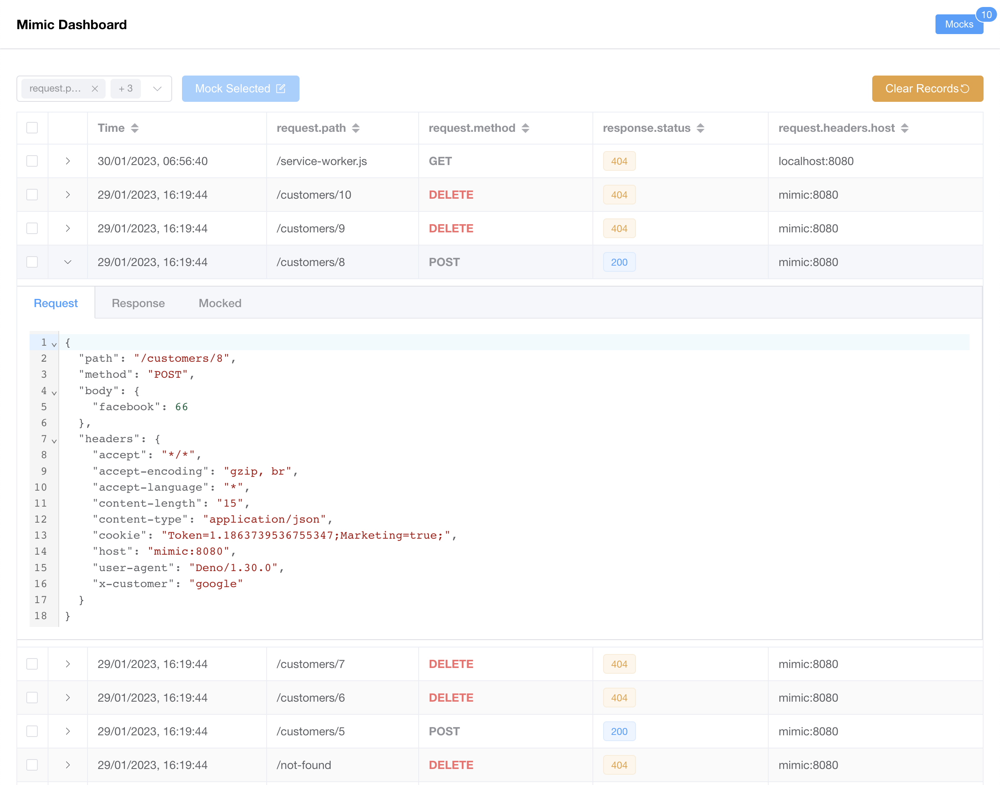
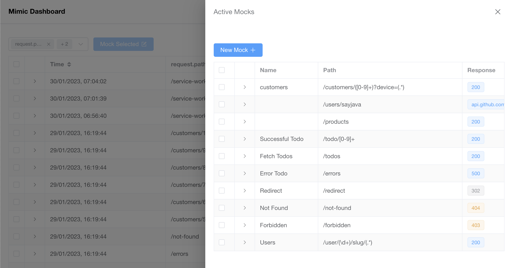
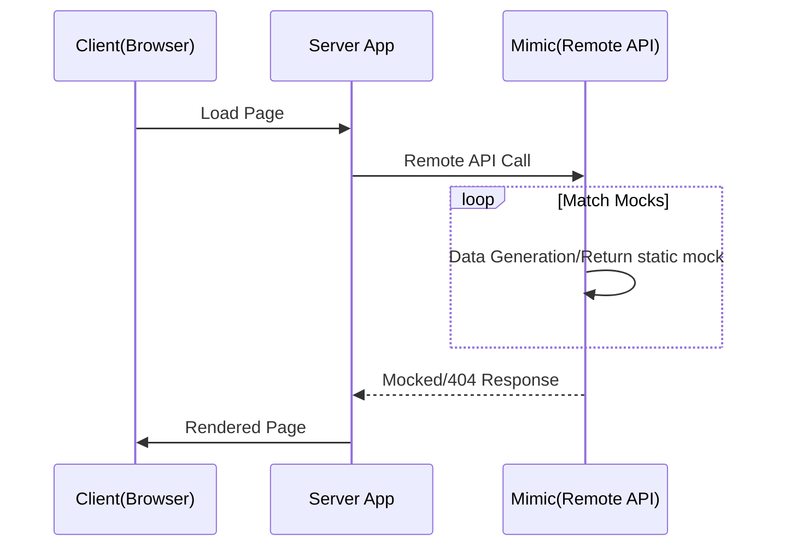
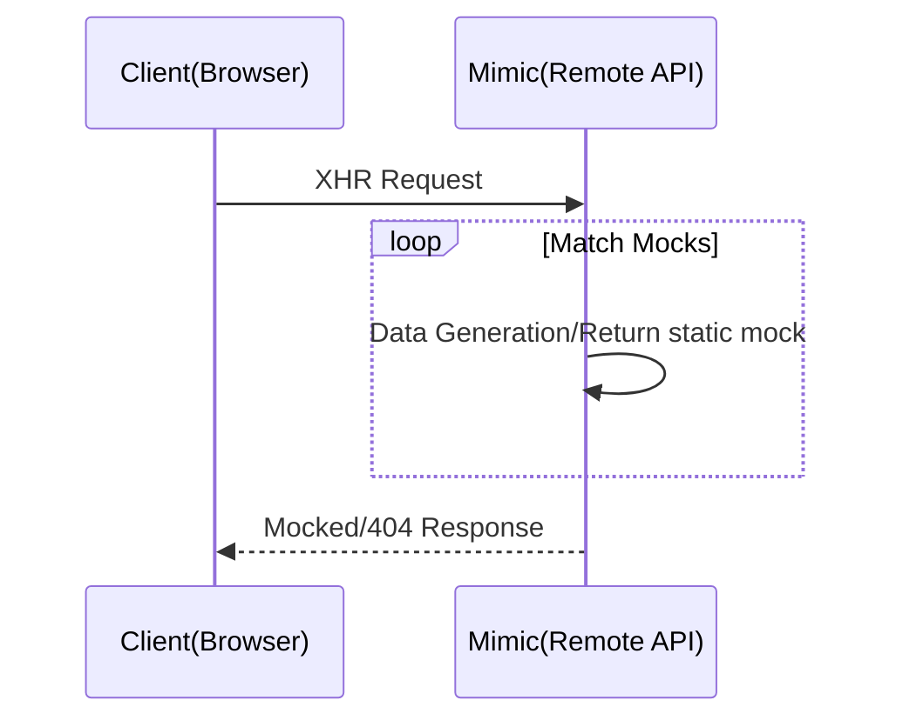
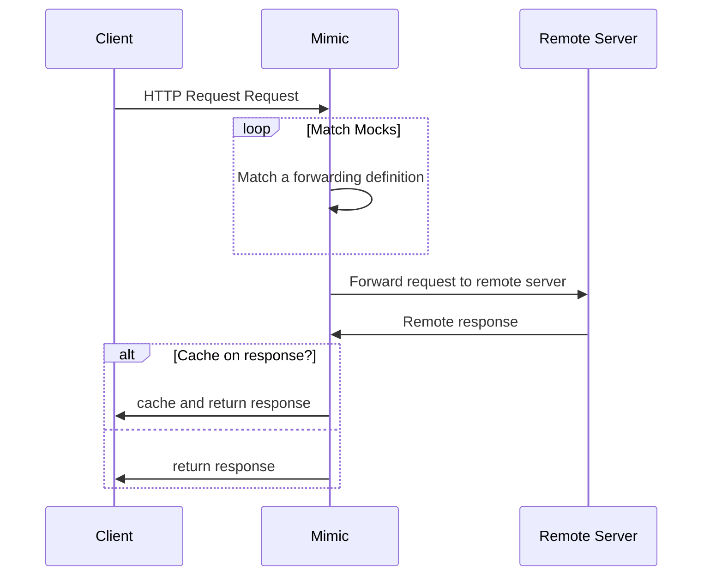

<h1 align="center">Mimic</h1>
<p align="center">
   Mimic is an API mocking and fake data generation server. It provides a simple approach to virtualizing services
</p>

<p align="center">

</p>

<p align="center">

</p>

## Why Mimic

- Prototype against APIs easily
- Test boundary values by mocking responses
- Test alternative scenarios by varying responses for requests
- Write predictable acceptance tests with predictable API responses
- Debug HTTP requests made by applications under development
- Generate large dataset using declarative response templates
- Validate API calls

## Mimic Features

- Declarative mock definitions
- Transparently proxy requests to remote servers.
- Built-in [handlebars](https://handlebarsjs.com/) and [Fakerjs](https://https://fakerjs.dev/) for large dataset generation.
- Reusable mock templates which helps to reduce mock duplications.

## Requirements

- Docker v20+

## Quick Start

```sh
    docker run docker.io/sayjava/mimic -p 8080:8080
```

The server is now running at `http://localhost:8080`. Any request made to that endpoint will be recorded and can be examined at `http://localhost:8080/_/dashboard`

### Use mock definitions

```sh
    docker run docker.io/sayjava/mimic -p 8080:8080 -v "mocks:/app/mocks"
```

This will load all the mock definitions present in the mocks folder.

## Mocking

Mocks are declarative yaml/json documents that instructs Mimic how to responds to the requests it receives. Here are some simple examples of mock definitions.

### Regex based request paths and methods

A very simple regexp based mock that will respond to requests with paths like `todo/2` or `todo/some-id` for both `GET` or `POST` request methods.

```yaml example.yaml
    - name: Sample Mock
      request: 
        path: /todo/.*
        method: GET|POST
      response:
        status: 200
        headers:
            content-type: application/json
        body:
          id: sample-id
          status: done
```

See the [Mock Definition](https//mimic.run/docs/mocking) docs here for more details

### Fake Data Generation

Fake data generation is built into Mimic. This endpoint `/todos` will consistently generate 10 todo objects

```yaml example.yaml
    - name: Dynamic Data
      request: 
        path: /todos
        method: GET
      response:
        status: 200
        headers:
            content-template: json/template
        body: |
            [
                {{#repeat 10}}
                    {
                        "title": "{{data.random.words}}",
                        "createdAt": "{{data.date.recent}}",
                    }
                {{/repeat}}
            ]

```

See the [Data Generation](https//mimic.run/docs/data-generation) docs for more examples

## Mimic Use Cases

Here are some use cases that `Mimic` can help with during development and testing.

### Fully Mocked Server Side Rendered Apps

Server side rendered apps can point their API endpoints to `Mimic` as the their remote API and all requests will be matched against mock definitions.



### Fully Mocked Client Side Rendered Apps

Server side rendered apps can point their API endpoints to `Mimic` as the their remote API and all requests will be matched against mock definitions.



### Transparent Proxy Mode

In this mode, `Mimic` acts as a transparent proxy by forwarding all requests it receives to a defined remote server transparently and depending on the mock definition, it will cache the response and respond with the cache on subsequent matching requests.



see the [proxy docs](https://mimic.run/docs/proxy) for more information on forwarding requests to remote servers


## Examples

- [Shopify Storefront](https://sayjava/mimic-shopify): Using the [Next Commerce](https://github.com/vercel/commerce) and `Mimic` to demonstrate the Shopify backend without the need for a shopify account.

- [BigCommerce Storefront](https://sayjava/mimic-bigcommerce): Using the [Next Commerce](https://github.com/vercel/commerce) and `Mimic` to demonstrate the BigCommerce backend without the need for a BigCommerce account.

## Development

```sh
    docker compose up
```

The Mimic mock server is started on `http://localhost:8080` and the UI dashboard can be reached at `http://localhost:9090/_/dashboard`

## Built With

- Deno v1.30
- VueJS 3.0
- Handlebars
- FakerJS

## Deploy

```shell
docker compose up
```
