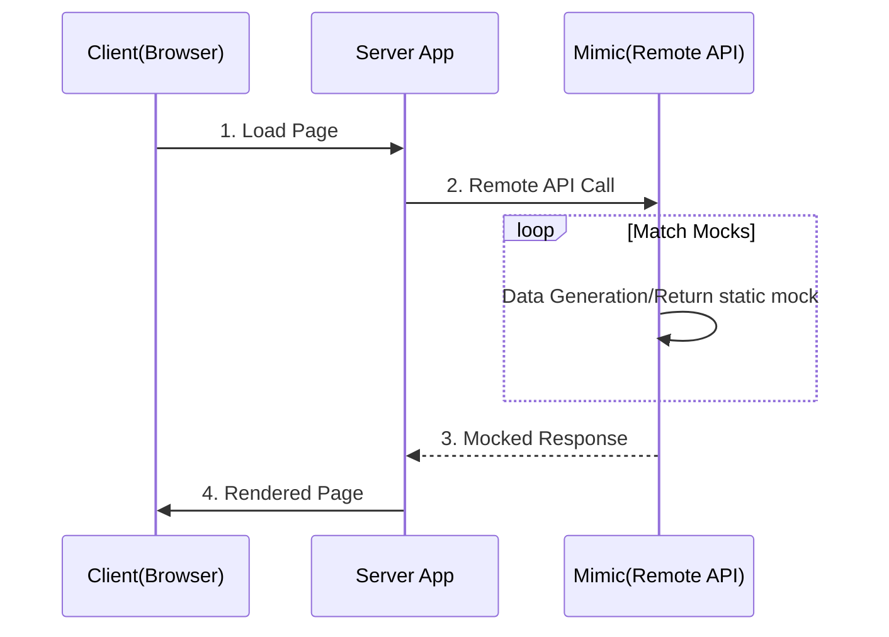

# Mimic

Prototyping applications has never been easier and faster. Easily Mock APIs

## Why

- Prototype against APIs easily
- Test boundary values by mocking responses
- Test alternative scenarios by varying responses
- Predictable acceptance tests with predictable API responses
- Debugging HTTP requests made your application
- Generate large dataset using declarative template

## Features

- Declarative mock definitions
- Transparent proxying of requests to remote servers.
- Built in [handlebars](https://handlebarsjs.com/) and [Fakerjs](https://https://fakerjs.dev/) for large dataset generation.
- Reusable mock templates which helps to reduce mock duplications.

## Scenarios



## Mocking

### A very simple regexp based mock that will respond to any `/todo/` e.g `todo/2` or `todo/some-id` for both `GET` or `POST` request methods

```yaml example.yaml
    - name: Sample Mock
      request: 
        path: /todo/.*
        method: GET|POST
      response:
        status: 200
        headers:
            content-type: application/json
        body:
          id: sample-id
          status: done
```

See the [Mock Definition](https//mimic.run/docs/mocking) docs here for more details

### Fake data generation. This endpoint `/todos` will consistently generate 10 todo objects

```yaml example.yaml
    - name: Dynamic Data
      request: 
        path: /todos
        method: GET
      response:
        status: 200
        headers:
            content-template: json/template
        body: |
            [
                {{#repeat 10}}
                    {
                        "title": "{{data.random.words}}",
                        "createdAt": "{{data.date.recent}}",
                    }
                {{/repeat}}
            ]

```

See the [Data Generation](https//mimic.run/docs/data-generation) docs for more examples

## Examples

- [Shopify Storefront](https://sayjava/mimic-shopify): Using the [Next Commerce](https://github.com/vercel/commerce) and `Mimic` to demonstrate the Shopify backend without the need for a shopify account.

- [BigCommerce Storefront](https://sayjava/mimic-shopify): Using the [Next Commerce](https://github.com/vercel/commerce) and `Mimic` to demonstrate the Shopify backend without the need for a BigCommerce account.

## Requirements

- Docker v20+

## Quick Start

```sh
    docker run docker.io/sayjava/mimic -p 8080:8080
```

The server is now running at `http://localhost:8080`. Any request made to that endpoint will recorded and can be examined at `http://localhost:8080/_/dashboard`

## Development

```sh
    docker compose up
```

## Built With

- Deno v1.30
- VueJS 3.0

## Deploy

```shell
docker compose up
```
